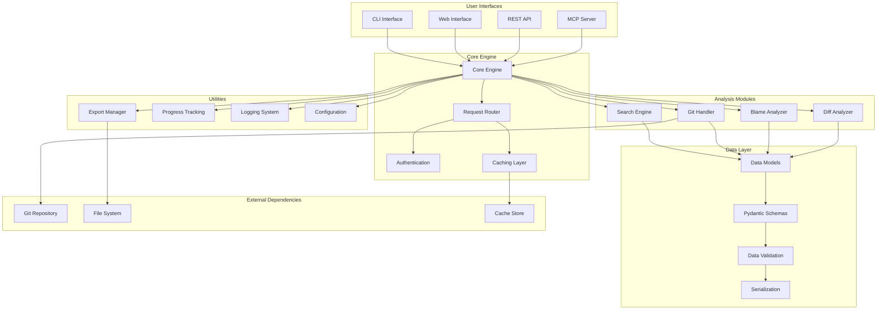
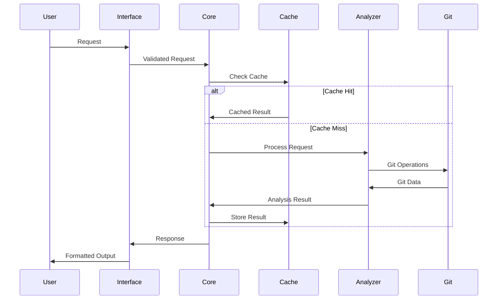

# Architecture Overview

GitHound is designed with a modular, extensible architecture that separates concerns and enables flexible usage across different interfaces and integration patterns.

## System Architecture

## Core Components

### 1. User Interfaces

#### CLI Interface (`githound/cli.py`)

- **Purpose**: Command-line interface using Typer
- **Features**: Rich terminal output, progress bars, interactive prompts
- **Integration**: Direct access to core engine
- **Output**: Formatted terminal output, file exports

#### Web Interface (`githound/web/`)

- **Purpose**: Browser-based interface using FastAPI
- **Features**: Interactive search, real-time updates, visual diff viewer
- **Components**:
  - `api.py`: REST API endpoints
  - `enhanced_api.py`: Advanced API features
  - `websocket.py`: Real-time communication
  - `server.py`: Web server management

#### MCP Server (`githound/mcp_server.py`)

- **Purpose**: Model Context Protocol server for AI integration
- **Features**: Structured tool interface, type-safe communication
- **Integration**: FastMCP framework
- **Use Cases**: AI assistants, automated analysis tools

### 2. Core Engine

#### Request Router

- **Purpose**: Route requests to appropriate handlers
- **Features**: Request validation, error handling, response formatting
- **Components**: Authentication, authorization, rate limiting

#### Caching Layer

- **Purpose**: Improve performance for expensive operations
- **Features**: Intelligent caching, cache invalidation, memory management
- **Storage**: In-memory and disk-based caching

### 3. Analysis Modules

#### Search Engine (`githound/search_engine/`)

- **Architecture**: Plugin-based searcher system
- **Components**:
  - `orchestrator.py`: Coordinates multiple searchers
  - `base.py`: Base classes and interfaces
  - `commit_searcher.py`: Commit-based searches
  - `file_searcher.py`: File-based searches
  - `fuzzy_searcher.py`: Fuzzy matching

#### Git Handler (`githound/git_handler.py`)

- **Purpose**: Git repository interaction and metadata extraction
- **Features**: Repository analysis, commit filtering, branch management
- **Integration**: GitPython library

#### Blame Analyzer (`githound/git_blame.py`)

- **Purpose**: Line-by-line authorship analysis
- **Features**: Author statistics, line history, contribution tracking
- **Output**: Detailed blame information with metadata

#### Diff Analyzer (`githound/git_diff.py`)

- **Purpose**: Change analysis between commits, branches, and files
- **Features**: Detailed diff analysis, change statistics, impact assessment
- **Output**: Structured diff data with context

### 4. Data Layer

#### Data Models (`githound/models.py`)

- **Purpose**: Core data structures and business logic
- **Features**: Type-safe data handling, validation, serialization
- **Components**: SearchQuery, SearchResult, CommitInfo, etc.

#### Schemas (`githound/schemas.py`)

- **Purpose**: Pydantic schemas for data validation and serialization
- **Features**: Comprehensive type definitions, JSON/YAML serialization
- **Components**: Repository, Commit, Author, Blame, Diff schemas

### 5. Utilities

#### Export Manager (`githound/utils/export.py`)

- **Purpose**: Data export in multiple formats
- **Features**: JSON, YAML, CSV, XML, Excel export
- **Capabilities**: Filtering, sorting, custom formatting

#### Progress Tracking (`githound/utils/progress.py`)

- **Purpose**: Real-time progress reporting
- **Features**: Progress bars, status updates, cancellation support
- **Integration**: Rich library for terminal output

## Design Principles

### 1. Modularity

- **Separation of Concerns**: Each module has a specific responsibility
- **Loose Coupling**: Modules interact through well-defined interfaces
- **High Cohesion**: Related functionality is grouped together

### 2. Extensibility

- **Plugin Architecture**: Easy to add new searchers and analyzers
- **Interface-based Design**: New implementations can be added easily
- **Configuration-driven**: Behavior can be modified through configuration

### 3. Type Safety

- **Full Type Annotations**: All code is fully type-annotated
- **Pydantic Models**: Data validation and serialization
- **MyPy Compliance**: Static type checking ensures correctness

### 4. Performance

- **Caching Strategy**: Intelligent caching of expensive operations
- **Parallel Processing**: Multi-threaded operations where beneficial
- **Memory Efficiency**: Streaming and lazy evaluation for large datasets

### 5. Reliability

- **Error Handling**: Comprehensive error handling and recovery
- **Input Validation**: All inputs are validated before processing
- **Logging**: Detailed logging for debugging and monitoring

## Data Flow

### 1. Request Processing

### 2. Search Operation Flow

## Configuration Management

### Configuration Hierarchy

1. **Default Configuration**: Built-in defaults
2. **System Configuration**: System-wide settings
3. **User Configuration**: User-specific settings
4. **Project Configuration**: Project-specific settings
5. **Environment Variables**: Runtime overrides
6. **Command-line Arguments**: Immediate overrides

### Configuration Sources

- **YAML Files**: Human-readable configuration
- **Environment Variables**: Runtime configuration
- **Command-line Arguments**: Immediate overrides
- **API Parameters**: Request-specific configuration

## Error Handling Strategy

### Error Categories

1. **User Errors**: Invalid input, missing files
2. **System Errors**: Git command failures, file system issues
3. **Configuration Errors**: Invalid configuration, missing dependencies
4. **Internal Errors**: Programming errors, unexpected conditions

### Error Response

- **Structured Errors**: Consistent error format across interfaces
- **Error Codes**: Specific error codes for programmatic handling
- **User-friendly Messages**: Clear, actionable error messages
- **Logging**: Detailed error logging for debugging

## Security Considerations

### Input Validation

- **Parameter Validation**: All inputs are validated
- **Path Sanitization**: File paths are sanitized to prevent traversal
- **Command Injection Prevention**: Git commands are parameterized

### Access Control

- **Repository Access**: Control access to specific repositories
- **Authentication**: Token-based authentication for API access
- **Authorization**: Role-based access control

### Data Privacy

- **Local Processing**: All analysis happens locally
- **No Data Transmission**: Repository data doesn't leave the system
- **Configurable Exposure**: Control what data is accessible

## Performance Characteristics

### Scalability

- **Large Repositories**: Handles repositories with millions of commits
- **Memory Management**: Efficient memory usage with streaming
- **Parallel Processing**: Multi-threaded operations for performance

### Caching Strategy

- **Multi-level Caching**: Memory and disk-based caching
- **Cache Invalidation**: Automatic cache updates
- **Cache Warming**: Proactive cache population

### Resource Management

- **Connection Pooling**: Efficient resource utilization
- **Request Throttling**: Prevent resource exhaustion
- **Graceful Degradation**: Maintain functionality under load

## Testing Strategy

### Test Categories

- **Unit Tests**: Individual component testing
- **Integration Tests**: Component interaction testing
- **API Tests**: Interface testing
- **Performance Tests**: Load and stress testing

### Test Coverage

- **Code Coverage**: Comprehensive test coverage
- **Type Coverage**: MyPy type checking
- **Functional Coverage**: Feature completeness testing

## Deployment Considerations

### Packaging

- **Python Package**: Standard pip-installable package
- **Docker Container**: Containerized deployment option
- **Standalone Executable**: Self-contained executable

### Dependencies

- **Minimal Dependencies**: Keep dependencies minimal and well-maintained
- **Version Pinning**: Specific version requirements for stability
- **Optional Dependencies**: Feature-specific optional dependencies

### Monitoring

- **Health Checks**: System health monitoring
- **Performance Metrics**: Performance tracking and alerting
- **Error Tracking**: Error monitoring and reporting
