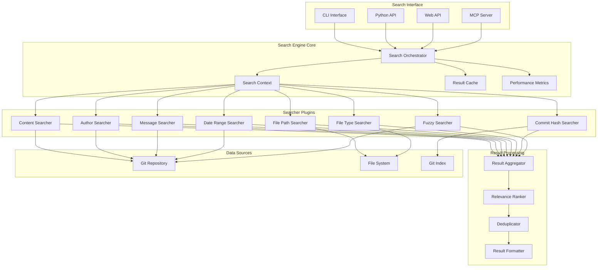
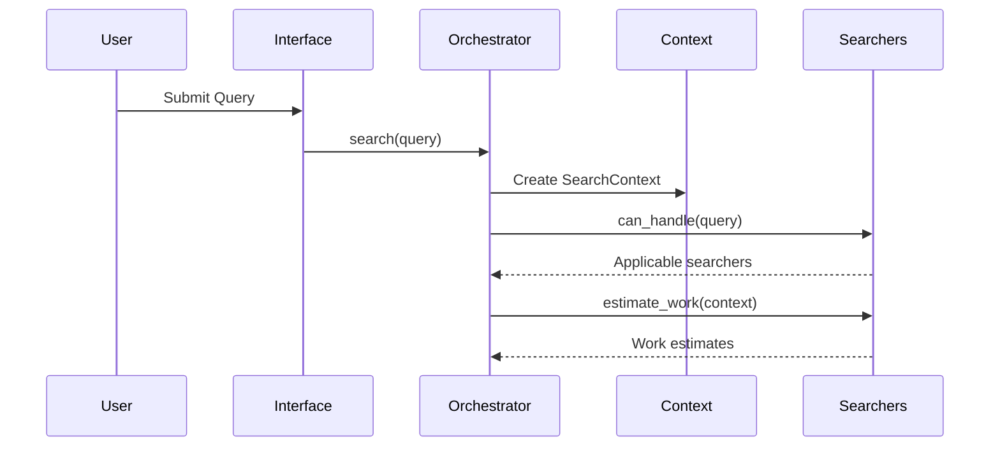
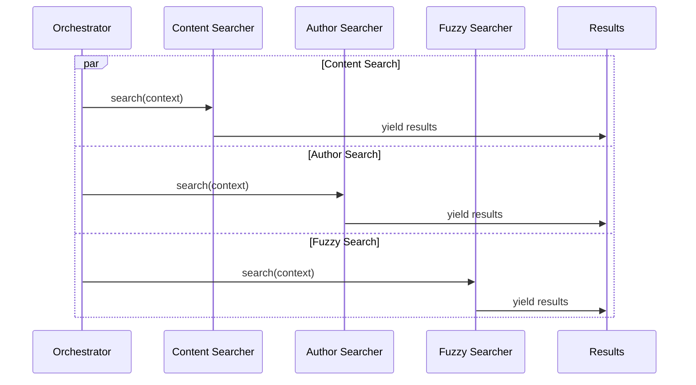
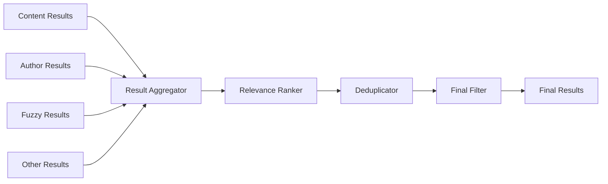

# Search Engine Architecture

GitHound's search engine is built on a modular, extensible architecture that provides powerful and flexible search capabilities across Git repositories. This document details the architecture, components, data flow, and design principles.

## Table of Contents

- [Architecture Overview](#architecture-overview)
- [Core Components](#core-components)
- [Search Orchestrator](#search-orchestrator)
- [Individual Searchers](#individual-searchers)
- [Data Flow](#data-flow)
- [Result Processing](#result-processing)
- [Performance Optimization](#performance-optimization)
- [Extensibility](#extensibility)
- [Design Patterns](#design-patterns)

## Architecture Overview

The GitHound search engine follows a **plugin-based architecture** with a central orchestrator coordinating multiple specialized searchers. This design provides flexibility, performance, and extensibility.



### Key Design Principles

1. **Modularity**: Each searcher is independent and focused on specific search types
2. **Extensibility**: New searchers can be added without modifying existing code
3. **Performance**: Parallel execution and intelligent caching
4. **Flexibility**: Support for complex multi-criteria queries
5. **Reliability**: Robust error handling and graceful degradation

## Core Components

### Search Context

The `SearchContext` provides shared state and configuration for all searchers:

```python
class SearchContext:
    """Shared context for search operations."""

    def __init__(
        self,
        repo: Repo,
        query: SearchQuery,
        branch: str | None = None,
        progress_callback: Callable[[str, float], None] | None = None,
        cache: dict | None = None,
    ):
        self.repo = repo
        self.query = query
        self.branch = branch or repo.active_branch.name
        self.progress_callback = progress_callback
        self.cache = cache or {}
        self.start_time = time.time()
```

**Features:**

- Shared repository access
- Query configuration
- Progress reporting
- Caching support
- Timing information

### Base Searcher Interface

All searchers implement the `BaseSearcher` interface:

```python
class BaseSearcher(ABC):
    """Abstract base class for all searchers."""

    @property
    @abstractmethod
    def name(self) -> str:
        """Unique name for this searcher."""
        pass

    @abstractmethod
    async def can_handle(self, query: SearchQuery) -> bool:
        """Check if this searcher can handle the given query."""
        pass

    @abstractmethod
    async def search(
        self,
        context: SearchContext
    ) -> AsyncGenerator[SearchResult, None]:
        """Perform the search and yield results."""
        pass

    @abstractmethod
    async def estimate_work(self, context: SearchContext) -> int:
        """Estimate the amount of work for progress reporting."""
        pass
```

### Specialized Base Classes

#### CacheableSearcher

For searchers that benefit from caching:

```python
class CacheableSearcher(BaseSearcher):
    """Base class for searchers that support caching."""

    def get_cache_key(self, context: SearchContext) -> str:
        """Generate cache key for the search."""
        pass

    async def get_cached_results(
        self,
        context: SearchContext
    ) -> list[SearchResult] | None:
        """Retrieve cached results if available."""
        pass

    async def cache_results(
        self,
        context: SearchContext,
        results: list[SearchResult]
    ) -> None:
        """Cache search results."""
        pass
```

#### ParallelSearcher

For searchers that can process multiple items concurrently:

```python
class ParallelSearcher(BaseSearcher):
    """Base class for searchers that support parallel processing."""

    def __init__(self, max_workers: int = 4):
        self.max_workers = max_workers

    async def process_batch(
        self,
        items: list[Any],
        context: SearchContext
    ) -> list[SearchResult]:
        """Process a batch of items in parallel."""
        pass
```

## Search Orchestrator

The `SearchOrchestrator` is the central coordinator that manages all searchers and orchestrates the search process.

### Core Functionality

```python
class SearchOrchestrator:
    """Coordinates multiple searchers for comprehensive search."""

    def __init__(self):
        self._searchers: list[BaseSearcher] = []
        self._metrics = SearchMetrics()

    def register_searcher(self, searcher: BaseSearcher) -> None:
        """Register a new searcher."""
        self._searchers.append(searcher)

    async def search(
        self,
        repo: Repo,
        query: SearchQuery,
        branch: str | None = None,
        progress_callback: Callable[[str, float], None] | None = None,
        cache: dict | None = None,
        max_results: int | None = None,
    ) -> AsyncGenerator[SearchResult, None]:
        """Perform comprehensive search using all applicable searchers."""
```

### Search Process

1. **Initialization**
   - Create search context
   - Determine applicable searchers
   - Estimate total work

2. **Parallel Execution**
   - Run applicable searchers concurrently
   - Monitor progress and handle errors
   - Collect results as they arrive

3. **Result Processing**
   - Aggregate results from all searchers
   - Apply relevance scoring
   - Remove duplicates
   - Apply final filtering and limits

4. **Metrics Collection**
   - Track search duration
   - Monitor memory usage
   - Count results and errors

### Searcher Selection Logic

```python
async def get_applicable_searchers(
    self,
    query: SearchQuery
) -> list[BaseSearcher]:
    """Determine which searchers can handle the query."""

    applicable = []
    for searcher in self._searchers:
        if await searcher.can_handle(query):
            applicable.append(searcher)

    return applicable
```

**Selection Criteria:**

- Content pattern → Content Searcher
- Author pattern → Author Searcher
- Message pattern → Message Searcher
- Date range → Date Range Searcher
- File path pattern → File Path Searcher
- File extensions → File Type Searcher
- Commit hash → Commit Hash Searcher
- Fuzzy search enabled → Fuzzy Searcher

### Progress Reporting

```python
def update_progress(
    self,
    searcher_name: str,
    progress: float,
    message: str
) -> None:
    """Update overall search progress."""

    # Calculate weighted progress across all searchers
    total_progress = sum(
        searcher_progress * searcher_weight
        for searcher_progress, searcher_weight in self._progress_weights.items()
    )

    if self._progress_callback:
        self._progress_callback(f"{searcher_name}: {message}", total_progress)
```

## Individual Searchers

Each searcher is specialized for specific types of queries and optimized for its particular use case.

### Content Searcher

Searches within file contents using pattern matching and regular expressions.

```python
class ContentSearcher(ParallelSearcher, CacheableSearcher):
    """Searches file contents for patterns."""

    name = "content"

    async def can_handle(self, query: SearchQuery) -> bool:
        """Can handle queries with content patterns."""
        return query.content_pattern is not None

    async def search(self, context: SearchContext) -> AsyncGenerator[SearchResult, None]:
        """Search file contents for the pattern."""

        # Get all files to search
        files = self._get_searchable_files(context)

        # Process files in parallel batches
        batch_size = 50
        for i in range(0, len(files), batch_size):
            batch = files[i:i + batch_size]
            results = await self._process_file_batch(batch, context)

            for result in results:
                yield result

    async def _process_file_batch(
        self,
        files: list[str],
        context: SearchContext
    ) -> list[SearchResult]:
        """Process a batch of files concurrently."""

        tasks = [
            self._search_file(file_path, context)
            for file_path in files
        ]

        batch_results = await asyncio.gather(*tasks, return_exceptions=True)

        # Filter out exceptions and flatten results
        results = []
        for result in batch_results:
            if isinstance(result, list):
                results.extend(result)

        return results
```

**Key Features:**

- Parallel file processing
- Binary file detection
- Large file handling
- Context line extraction
- Pattern compilation caching

### Author Searcher

Searches for commits by author information.

```python
class AuthorSearcher(CacheableSearcher):
    """Searches commits by author name or email."""

    name = "author"

    async def can_handle(self, query: SearchQuery) -> bool:
        """Can handle queries with author patterns."""
        return query.author_pattern is not None

    async def search(self, context: SearchContext) -> AsyncGenerator[SearchResult, None]:
        """Search commits by author."""

        pattern = context.query.author_pattern.lower()

        # Iterate through commits
        for commit in context.repo.iter_commits(context.branch):
            author_name = commit.author.name.lower()
            author_email = commit.author.email.lower()

            # Check if pattern matches name or email
            if pattern in author_name or pattern in author_email:
                # Get files changed in this commit
                for file_path in commit.stats.files:
                    yield SearchResult(
                        commit_hash=commit.hexsha,
                        file_path=file_path,
                        line_number=0,
                        content=f"Author: {commit.author.name} <{commit.author.email}>",
                        relevance_score=self._calculate_author_relevance(pattern, commit),
                        author=f"{commit.author.name} <{commit.author.email}>",
                        commit_date=commit.committed_datetime,
                        commit_message=commit.message.strip(),
                        context_before=[],
                        context_after=[],
                        file_size=0,
                        match_type="author"
                    )
```

### Fuzzy Searcher

Performs approximate string matching with configurable similarity thresholds.

```python
class FuzzySearcher(BaseSearcher):
    """Performs fuzzy string matching."""

    name = "fuzzy"

    def __init__(self, default_threshold: float = 0.8):
        self.default_threshold = default_threshold

    async def can_handle(self, query: SearchQuery) -> bool:
        """Can handle queries with fuzzy search enabled."""
        return query.fuzzy_search and query.content_pattern is not None

    async def search(self, context: SearchContext) -> AsyncGenerator[SearchResult, None]:
        """Perform fuzzy search across repository content."""

        from rapidfuzz import fuzz, process

        query_pattern = context.query.content_pattern
        threshold = context.query.fuzzy_threshold or self.default_threshold

        # Get all text content from repository
        content_items = await self._extract_text_content(context)

        # Perform fuzzy matching
        matches = process.extract(
            query_pattern,
            content_items,
            scorer=fuzz.WRatio,
            score_cutoff=threshold * 100,
            limit=None
        )

        # Convert matches to SearchResults
        for match_text, score, item_info in matches:
            yield SearchResult(
                commit_hash=item_info['commit_hash'],
                file_path=item_info['file_path'],
                line_number=item_info['line_number'],
                content=match_text,
                relevance_score=score / 100.0,
                author=item_info['author'],
                commit_date=item_info['commit_date'],
                commit_message=item_info['commit_message'],
                context_before=item_info.get('context_before', []),
                context_after=item_info.get('context_after', []),
                file_size=item_info.get('file_size', 0),
                match_type="fuzzy"
            )
```

### File Path Searcher

Searches based on file paths and directory structures.

```python
class FilePathSearcher(BaseSearcher):
    """Searches by file path patterns."""

    name = "file_path"

    async def can_handle(self, query: SearchQuery) -> bool:
        """Can handle queries with file path patterns."""
        return query.file_path_pattern is not None

    async def search(self, context: SearchContext) -> AsyncGenerator[SearchResult, None]:
        """Search by file path patterns."""

        import fnmatch

        pattern = context.query.file_path_pattern

        # Get all files in repository
        for commit in context.repo.iter_commits(context.branch, max_count=1):
            for item in commit.tree.traverse():
                if item.type == 'blob':  # File (not directory)
                    file_path = item.path

                    # Check if path matches pattern
                    if fnmatch.fnmatch(file_path, pattern):
                        yield SearchResult(
                            commit_hash=commit.hexsha,
                            file_path=file_path,
                            line_number=0,
                            content=f"File path: {file_path}",
                            relevance_score=self._calculate_path_relevance(pattern, file_path),
                            author=f"{commit.author.name} <{commit.author.email}>",
                            commit_date=commit.committed_datetime,
                            commit_message=commit.message.strip(),
                            context_before=[],
                            context_after=[],
                            file_size=item.size,
                            match_type="file_path"
                        )
```

## Data Flow

The search engine follows a well-defined data flow from query input to result output:

### 1. Query Processing



### 2. Parallel Execution



### 3. Result Aggregation



### 4. Progress Tracking

```python
class ProgressTracker:
    """Tracks search progress across multiple searchers."""

    def __init__(self, searchers: list[BaseSearcher], callback: Callable):
        self.searchers = searchers
        self.callback = callback
        self.progress = {searcher.name: 0.0 for searcher in searchers}
        self.weights = self._calculate_weights()

    def update_searcher_progress(self, searcher_name: str, progress: float):
        """Update progress for a specific searcher."""
        self.progress[searcher_name] = progress

        # Calculate overall progress
        total_progress = sum(
            self.progress[name] * self.weights[name]
            for name in self.progress
        )

        self.callback(f"Search progress: {total_progress:.1%}", total_progress)
```

## Result Processing

### Relevance Scoring

Each searcher calculates relevance scores based on different criteria:

```python
class RelevanceCalculator:
    """Calculates relevance scores for search results."""

    @staticmethod
    def content_relevance(pattern: str, content: str, match_type: str) -> float:
        """Calculate relevance for content matches."""

        # Exact matches get highest score
        if pattern.lower() in content.lower():
            exact_score = 1.0
        else:
            exact_score = 0.0

        # Pattern complexity bonus
        complexity_bonus = min(len(pattern) / 50.0, 0.2)

        # Match type modifier
        type_modifiers = {
            "exact": 1.0,
            "regex": 0.9,
            "fuzzy": 0.8,
            "partial": 0.7
        }

        base_score = exact_score + complexity_bonus
        return base_score * type_modifiers.get(match_type, 0.5)

    @staticmethod
    def author_relevance(pattern: str, author_name: str, author_email: str) -> float:
        """Calculate relevance for author matches."""

        pattern_lower = pattern.lower()
        name_lower = author_name.lower()
        email_lower = author_email.lower()

        # Exact name match
        if pattern_lower == name_lower:
            return 1.0

        # Exact email match
        if pattern_lower == email_lower:
            return 0.95

        # Partial matches
        name_score = 0.8 if pattern_lower in name_lower else 0.0
        email_score = 0.7 if pattern_lower in email_lower else 0.0

        return max(name_score, email_score)
```

### Deduplication

Results from multiple searchers may overlap and need deduplication:

```python
class ResultDeduplicator:
    """Removes duplicate results from multiple searchers."""

    def __init__(self, similarity_threshold: float = 0.95):
        self.similarity_threshold = similarity_threshold

    def deduplicate(self, results: list[SearchResult]) -> list[SearchResult]:
        """Remove duplicate results."""

        unique_results = []
        seen_signatures = set()

        for result in results:
            signature = self._generate_signature(result)

            if signature not in seen_signatures:
                # Check for near-duplicates
                if not self._is_near_duplicate(result, unique_results):
                    unique_results.append(result)
                    seen_signatures.add(signature)

        return unique_results

    def _generate_signature(self, result: SearchResult) -> str:
        """Generate unique signature for a result."""
        return f"{result.commit_hash}:{result.file_path}:{result.line_number}"

    def _is_near_duplicate(
        self,
        result: SearchResult,
        existing: list[SearchResult]
    ) -> bool:
        """Check if result is near-duplicate of existing results."""

        for existing_result in existing:
            if (result.file_path == existing_result.file_path and
                abs(result.line_number - existing_result.line_number) <= 2 and
                self._content_similarity(result.content, existing_result.content) > self.similarity_threshold):
                return True

        return False
```

## Performance Optimization

The search engine employs several optimization strategies to handle large repositories efficiently.

### 1. Parallel Processing

```python
class ParallelExecutor:
    """Manages parallel execution of search operations."""

    def __init__(self, max_workers: int = None):
        self.max_workers = max_workers or min(32, (os.cpu_count() or 1) + 4)
        self.executor = ThreadPoolExecutor(max_workers=self.max_workers)

    async def execute_parallel(
        self,
        tasks: list[Callable],
        context: SearchContext
    ) -> list[Any]:
        """Execute tasks in parallel with proper resource management."""

        loop = asyncio.get_event_loop()

        # Submit all tasks
        futures = [
            loop.run_in_executor(self.executor, task, context)
            for task in tasks
        ]

        # Wait for completion with timeout
        try:
            results = await asyncio.wait_for(
                asyncio.gather(*futures, return_exceptions=True),
                timeout=context.query.timeout or 300
            )
            return results

        except asyncio.TimeoutError:
            # Cancel remaining tasks
            for future in futures:
                future.cancel()
            raise
```

### 2. Intelligent Caching

```python
class SearchCache:
    """Multi-level caching system for search results."""

    def __init__(self, max_memory_mb: int = 256):
        self.max_memory_bytes = max_memory_mb * 1024 * 1024
        self.memory_cache = {}
        self.cache_stats = {"hits": 0, "misses": 0, "evictions": 0}
        self.current_memory = 0

    def get(self, cache_key: str) -> list[SearchResult] | None:
        """Get cached results."""

        if cache_key in self.memory_cache:
            self.cache_stats["hits"] += 1
            # Move to end (LRU)
            item = self.memory_cache.pop(cache_key)
            self.memory_cache[cache_key] = item
            return item["results"]

        self.cache_stats["misses"] += 1
        return None

    def put(self, cache_key: str, results: list[SearchResult]) -> None:
        """Cache search results."""

        # Estimate memory usage
        estimated_size = self._estimate_size(results)

        # Evict if necessary
        while (self.current_memory + estimated_size > self.max_memory_bytes and
               self.memory_cache):
            self._evict_lru()

        # Store in cache
        self.memory_cache[cache_key] = {
            "results": results,
            "size": estimated_size,
            "timestamp": time.time()
        }
        self.current_memory += estimated_size
```

### 3. Memory Management

```python
class MemoryManager:
    """Manages memory usage during search operations."""

    def __init__(self, max_memory_mb: int = 512):
        self.max_memory_bytes = max_memory_mb * 1024 * 1024
        self.current_usage = 0
        self.result_buffers = {}

    def check_memory_limit(self) -> bool:
        """Check if memory usage is within limits."""

        import psutil
        process = psutil.Process()
        memory_info = process.memory_info()

        return memory_info.rss < self.max_memory_bytes

    def create_result_buffer(self, searcher_name: str) -> ResultBuffer:
        """Create a memory-efficient result buffer."""

        buffer = ResultBuffer(
            max_size=1000,  # Max results in memory
            spill_to_disk=True,
            compression=True
        )

        self.result_buffers[searcher_name] = buffer
        return buffer

    def cleanup_buffers(self) -> None:
        """Clean up all result buffers."""

        for buffer in self.result_buffers.values():
            buffer.cleanup()

        self.result_buffers.clear()
```

### 4. Query Optimization

```python
class QueryOptimizer:
    """Optimizes search queries for better performance."""

    def optimize_query(self, query: SearchQuery) -> SearchQuery:
        """Optimize query for better performance."""

        optimized = query.copy()

        # Add file size limits if not specified
        if optimized.max_file_size is None:
            optimized.max_file_size = 10 * 1024 * 1024  # 10MB default

        # Add common exclusions
        if optimized.exclude_globs is None:
            optimized.exclude_globs = []

        optimized.exclude_globs.extend([
            "*.min.js", "*.min.css", "*.map",
            "node_modules/*", ".git/*", "*.lock",
            "*.jpg", "*.png", "*.gif", "*.pdf",
            "*.zip", "*.tar.gz", "*.exe", "*.dll"
        ])

        # Optimize regex patterns
        if optimized.content_pattern and not optimized.case_sensitive:
            # Compile case-insensitive regex for better performance
            optimized.content_pattern = f"(?i){optimized.content_pattern}"

        return optimized
```

## Extensibility

The search engine is designed for easy extension with new searchers and capabilities.

### Creating Custom Searchers

```python
class CustomSearcher(BaseSearcher):
    """Example custom searcher implementation."""

    name = "custom"

    async def can_handle(self, query: SearchQuery) -> bool:
        """Define when this searcher should be used."""
        return hasattr(query, 'custom_field') and query.custom_field is not None

    async def search(self, context: SearchContext) -> AsyncGenerator[SearchResult, None]:
        """Implement custom search logic."""

        # Custom search implementation
        custom_value = context.query.custom_field

        # Example: Search for custom patterns
        for commit in context.repo.iter_commits(context.branch):
            if self._matches_custom_criteria(commit, custom_value):
                yield SearchResult(
                    commit_hash=commit.hexsha,
                    file_path="",
                    line_number=0,
                    content=f"Custom match: {custom_value}",
                    relevance_score=1.0,
                    author=f"{commit.author.name} <{commit.author.email}>",
                    commit_date=commit.committed_datetime,
                    commit_message=commit.message.strip(),
                    context_before=[],
                    context_after=[],
                    file_size=0,
                    match_type="custom"
                )

    async def estimate_work(self, context: SearchContext) -> int:
        """Estimate work for progress reporting."""
        # Return estimated number of operations
        return len(list(context.repo.iter_commits(context.branch, max_count=1000)))

    def _matches_custom_criteria(self, commit, custom_value) -> bool:
        """Custom matching logic."""
        # Implement custom matching criteria
        return custom_value.lower() in commit.message.lower()

# Register the custom searcher
orchestrator = SearchOrchestrator()
orchestrator.register_searcher(CustomSearcher())
```

### Plugin System

```python
class SearcherPlugin:
    """Base class for searcher plugins."""

    @abstractmethod
    def get_searchers(self) -> list[BaseSearcher]:
        """Return list of searchers provided by this plugin."""
        pass

    @abstractmethod
    def get_name(self) -> str:
        """Return plugin name."""
        pass

    @abstractmethod
    def get_version(self) -> str:
        """Return plugin version."""
        pass

class PluginManager:
    """Manages searcher plugins."""

    def __init__(self):
        self.plugins = {}
        self.searchers = {}

    def register_plugin(self, plugin: SearcherPlugin) -> None:
        """Register a new plugin."""

        name = plugin.get_name()
        self.plugins[name] = plugin

        # Register all searchers from the plugin
        for searcher in plugin.get_searchers():
            self.searchers[searcher.name] = searcher

    def get_all_searchers(self) -> list[BaseSearcher]:
        """Get all searchers from all plugins."""
        return list(self.searchers.values())
```

## Design Patterns

The search engine employs several design patterns for maintainability and extensibility.

### 1. Strategy Pattern

Each searcher implements the same interface but uses different strategies:

```python
# Different search strategies
content_strategy = ContentSearcher()
author_strategy = AuthorSearcher()
fuzzy_strategy = FuzzySearcher()

# All implement the same interface
for strategy in [content_strategy, author_strategy, fuzzy_strategy]:
    if await strategy.can_handle(query):
        async for result in strategy.search(context):
            process_result(result)
```

### 2. Observer Pattern

Progress reporting uses the observer pattern:

```python
class ProgressObserver:
    """Observer for search progress updates."""

    def update(self, searcher_name: str, progress: float, message: str) -> None:
        """Handle progress update."""
        print(f"{searcher_name}: {message} ({progress:.1%})")

# Register observers
orchestrator.add_progress_observer(ProgressObserver())
orchestrator.add_progress_observer(WebSocketProgressObserver())
```

### 3. Factory Pattern

Searcher creation uses the factory pattern:

```python
class SearcherFactory:
    """Factory for creating searchers."""

    _searcher_classes = {
        "content": ContentSearcher,
        "author": AuthorSearcher,
        "message": MessageSearcher,
        "fuzzy": FuzzySearcher,
        # ... other searchers
    }

    @classmethod
    def create_searcher(cls, searcher_type: str, **kwargs) -> BaseSearcher:
        """Create a searcher of the specified type."""

        if searcher_type not in cls._searcher_classes:
            raise ValueError(f"Unknown searcher type: {searcher_type}")

        searcher_class = cls._searcher_classes[searcher_type]
        return searcher_class(**kwargs)

    @classmethod
    def create_all_searchers(cls) -> list[BaseSearcher]:
        """Create instances of all available searchers."""

        return [
            searcher_class()
            for searcher_class in cls._searcher_classes.values()
        ]
```

### 4. Command Pattern

Search operations use the command pattern for undo/redo and queuing:

```python
class SearchCommand:
    """Command for executing a search operation."""

    def __init__(self, orchestrator: SearchOrchestrator, query: SearchQuery):
        self.orchestrator = orchestrator
        self.query = query
        self.results = []
        self.executed = False

    async def execute(self, context: SearchContext) -> list[SearchResult]:
        """Execute the search command."""

        if self.executed:
            return self.results

        self.results = []
        async for result in self.orchestrator.search(context.repo, self.query):
            self.results.append(result)

        self.executed = True
        return self.results

    def undo(self) -> None:
        """Undo the search (clear results)."""
        self.results = []
        self.executed = False

class SearchCommandQueue:
    """Queue for managing search commands."""

    def __init__(self):
        self.commands = []
        self.current_index = -1

    def add_command(self, command: SearchCommand) -> None:
        """Add a command to the queue."""
        # Remove any commands after current index
        self.commands = self.commands[:self.current_index + 1]
        self.commands.append(command)
        self.current_index += 1

    async def execute_current(self, context: SearchContext) -> list[SearchResult]:
        """Execute the current command."""
        if 0 <= self.current_index < len(self.commands):
            return await self.commands[self.current_index].execute(context)
        return []
```

This comprehensive architecture enables GitHound to provide powerful, flexible, and performant search capabilities across Git repositories. The modular design allows for easy extension and customization while maintaining high performance and reliability.
