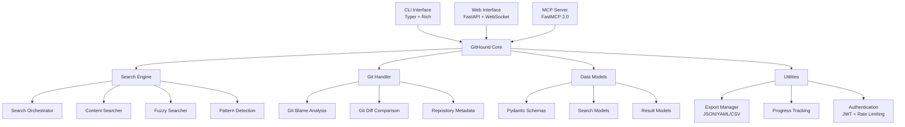

# GitHound Documentation

Welcome to GitHound, a comprehensive Git repository analysis tool that provides advanced search
capabilities, detailed metadata extraction, blame analysis, diff comparison, and multiple
integration options.

## 🚀 Key Features

### Advanced Git Analysis

- **Multi-modal Search**: Search by content, commit hash, author, message, date range, file path,
  and file type
- **Fuzzy Search**: Find approximate matches with configurable similarity thresholds
- **Git Blame Analysis**: Line-by-line authorship tracking with detailed history
- **Diff Analysis**: Compare commits, branches, and files with detailed change analysis
- **Repository Metadata**: Comprehensive repository statistics and contributor analysis

### Integration Options

- **MCP Server**: Model Context Protocol server with 29 tools for AI integration
- **REST API**: Comprehensive API with OpenAPI documentation and authentication
- **WebSocket Support**: Real-time updates and streaming results with rate limiting
- **CLI Interface**: Powerful command-line interface with rich output formatting
- **Web Interface**: Modern browser-based interface with interactive features

### Data Export & Formats

- **Core Formats**: JSON, YAML, CSV, and text formats
- **Optional Formats**: Excel (requires pandas/openpyxl), XML (planned)
- **Structured Schemas**: Standardized data formats with comprehensive type information
- **Advanced Filtering**: Filter and sort results with flexible criteria
- **Progress Tracking**: Real-time progress reporting with cancellation support

## 🎯 Use Cases

### For Developers

- **Code Archaeology**: Understand how code evolved over time
- **Bug Investigation**: Track down when and why bugs were introduced
- **Refactoring Planning**: Identify code patterns and dependencies
- **Code Review**: Analyze changes and their impact

### For Project Managers

- **Team Analytics**: Understand team contributions and patterns
- **Release Planning**: Analyze changes between releases
- **Quality Metrics**: Track code quality and technical debt
- **Risk Assessment**: Identify high-risk areas and dependencies

### For AI/ML Applications

- **Training Data**: Extract structured git data for ML models
- **Code Understanding**: Provide context for AI code assistants
- **Automated Analysis**: Integrate with AI workflows via MCP Server
- **Pattern Recognition**: Identify development patterns and anomalies

## 🏗️ Architecture Overview

GitHound is built with a modular architecture that separates concerns and enables flexible usage:

## 📚 Documentation Navigation

### 🚀 Getting Started

Start here if you're new to GitHound:

- [Installation Guide](getting-started/installation.md) - Complete setup instructions for all platforms
- [Quick Start](getting-started/quick-start.md) - Get up and running in 5 minutes
- [Configuration](getting-started/configuration.md) - Basic configuration and environment setup

### 📖 User Guides

Learn how to use GitHound effectively:

- [CLI Usage](user-guide/cli-usage.md) - Complete command-line interface guide
- [Search Capabilities](user-guide/search-capabilities.md) - Advanced search features and patterns
- [Export Options](user-guide/export-options.md) - Data export formats and options
- [Web Interface](user-guide/web-interface.md) - Web-based interface and features

### 🔌 API Reference

Complete API documentation for developers:

- [Python API](api-reference/python-api.md) - Complete Python library documentation
- [REST API](api-reference/rest-api.md) - HTTP API endpoints and examples
- [WebSocket API](api-reference/websocket-api.md) - Real-time API documentation
- [OpenAPI Specification](api-reference/openapi.md) - Interactive API documentation

### 🤖 Integration Guides

Connect GitHound with other tools and services:

- [MCP Server Overview](mcp-server/README.md) - Model Context Protocol integration
- [MCP Setup Guide](mcp-server/setup.md) - Installation and configuration
- [MCP Tools Reference](mcp-server/tools-reference.md) - Available tools and resources
- [Integration Examples](mcp-server/integration-examples.md) - Real-world usage examples

### 🔐 Security & Authentication

Configure secure access and authentication:

- [Configuration Guide](getting-started/configuration.md) - Configuration methods and security practices

### 🏗️ Architecture & Development

Understand GitHound's design and contribute to development:

- [Architecture Overview](architecture/overview.md) - System design and components
- [Search Engine](architecture/search-engine.md) - Search system architecture

### 🛠️ Troubleshooting & Support

Get help when things go wrong:

- [Troubleshooting Guide](troubleshooting/README.md) - Common issues and solutions
- [FAQ](troubleshooting/faq.md) - Frequently asked questions

## 🔧 Technology Stack

- **Python 3.11+**: Modern Python with full type annotation support
- **FastAPI**: High-performance web framework for REST APIs and WebSocket support
- **Pydantic**: Data validation and serialization with comprehensive type safety
- **GitPython**: Comprehensive Git repository interaction and analysis
- **FastMCP 2.0**: Model Context Protocol server implementation for AI integration
- **Typer**: Modern CLI framework with rich console output and formatting
- **Hatch**: Modern Python build system with VCS versioning
- **MyPy**: Static type checking for enhanced code quality and reliability

## 📈 Performance & Scalability

GitHound is designed for performance and can handle large repositories efficiently:

- **Async Operations**: Non-blocking I/O for better concurrency and responsiveness
- **Search Orchestration**: Unified search coordination with optimized query execution
- **Streaming Export**: Memory-efficient processing of large datasets with streaming CSV export
- **Progress Tracking**: Real-time feedback for long-running operations via WebSocket
- **Rate Limiting**: Built-in protection against API abuse with Redis-backed limiting
- **Caching**: Intelligent caching of repository metadata and search results

## 🤝 Community & Support

- **GitHub Issues**: Report bugs and request features
- **Discussions**: Ask questions and share ideas
- **Contributing**: Help improve GitHound
- **Documentation**: Comprehensive guides and API reference

## 📄 License

GitHound is released under the MIT License. See the
[LICENSE](https://github.com/your-org/githound/blob/main/LICENSE) file for details.

---

Ready to get started? Check out our [Installation Guide](getting-started/installation.md) or jump
into the [Quick Start](getting-started/quick-start.md) tutorial!
