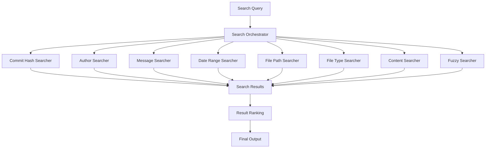

# Search Capabilities

GitHound provides powerful and flexible search capabilities that allow you to find information across your Git repository using multiple search strategies. This guide covers all search features, from basic content searches to advanced multi-modal queries.

## Table of Contents

- [Overview](#overview)
- [Search Engine Architecture](#search-engine-architecture)
- [Search Types](#search-types)
- [Search Orchestrator](#search-orchestrator)
- [Query Syntax](#query-syntax)
- [Advanced Search Features](#advanced-search-features)
- [Performance Optimization](#performance-optimization)
- [CLI Examples](#cli-examples)
- [Python API Examples](#python-api-examples)
- [Best Practices](#best-practices)

## Overview

GitHound's search engine is built on a modular architecture with specialized searchers that can work independently or in combination. The system supports:

- **8 Specialized Searchers**: Each optimized for specific search types
- **Multi-modal Queries**: Combine multiple search criteria in a single query
- **Fuzzy Matching**: Find approximate matches with configurable similarity
- **Real-time Progress**: Track search progress for large repositories
- **Flexible Filtering**: Advanced filtering by file type, size, date, and patterns
- **Relevance Scoring**: Results ranked by relevance and quality

## Search Engine Architecture

GitHound uses a **Search Orchestrator** that coordinates multiple specialized searchers:



## Search Types

GitHound provides 8 specialized searchers, each optimized for different types of queries:

### 1. Content Searcher

Searches within file contents using pattern matching and regular expressions.

**Features:**
- Regular expression support
- Case-sensitive/insensitive matching
- Context lines around matches
- Binary file detection and skipping
- Large file handling

**Use Cases:**
- Finding specific functions or variables
- Locating TODO comments or bug markers
- Searching for configuration values
- Code pattern analysis

**CLI Examples:**
```bash
# Basic content search
githound search "function authenticate" /path/to/repo

# Regex pattern search
githound search "def\s+\w+_handler" /path/to/repo --regex

# Case-sensitive search
githound search "API_KEY" /path/to/repo --case-sensitive

# Search with context
githound search "TODO" /path/to/repo --context 3
```

**Python API:**
```python
from githound.models import SearchQuery

# Basic content search
query = SearchQuery(content_pattern="function authenticate")

# Regex search
query = SearchQuery(
    content_pattern=r"def\s+\w+_handler",
    case_sensitive=True
)

# Search with file filtering
query = SearchQuery(
    content_pattern="TODO",
    file_extensions=["py", "js"],
    max_file_size=1024*1024  # 1MB limit
)
```

### 2. Author Searcher

Searches for commits by author name or email address.

**Features:**
- Name and email pattern matching
- Partial name matching
- Case-insensitive author search
- Author alias resolution

**Use Cases:**
- Finding all commits by a specific developer
- Tracking contributions by team members
- Analyzing author activity patterns
- Code ownership analysis

**CLI Examples:**
```bash
# Search by author name
githound search --author "John Doe" /path/to/repo

# Search by email
githound search --author "john@example.com" /path/to/repo

# Partial author search
githound search --author "john" /path/to/repo

# Combined author and content search
githound search --author "alice" "bug fix" /path/to/repo
```

**Python API:**
```python
# Author-only search
query = SearchQuery(author_pattern="John Doe")

# Author with email
query = SearchQuery(author_pattern="john@example.com")

# Combined author and content
query = SearchQuery(
    author_pattern="alice",
    content_pattern="bug fix"
)
```

### 3. Message Searcher

Searches commit messages for specific keywords or patterns.

**Features:**
- Keyword and phrase matching
- Regular expression support in messages
- Case-insensitive message search
- Multi-word phrase matching

**Use Cases:**
- Finding bug fixes and feature implementations
- Tracking specific issues or tickets
- Analyzing commit message patterns
- Release and version tracking

**CLI Examples:**
```bash
# Search commit messages
githound search --message "bug fix" /path/to/repo

# Search for issue references
githound search --message "#123" /path/to/repo

# Regex in commit messages
githound search --message "fix.*security" /path/to/repo --regex

# Combined message and author search
githound search --message "feature" --author "alice" /path/to/repo
```

**Python API:**
```python
# Message search
query = SearchQuery(message_pattern="bug fix")

# Issue tracking
query = SearchQuery(message_pattern=r"#\d+")

# Combined criteria
query = SearchQuery(
    message_pattern="feature",
    author_pattern="alice",
    date_from=datetime(2023, 1, 1)
)
```

### 4. Date Range Searcher

Filters commits by date ranges and time periods.

**Features:**
- Flexible date range specification
- Relative date expressions
- Time zone handling
- Date format auto-detection

**Use Cases:**
- Analyzing activity in specific time periods
- Finding changes around release dates
- Tracking development velocity
- Historical code analysis

**CLI Examples:**
```bash
# Search by date range
githound search --date-from "2023-01-01" --date-to "2023-12-31" /path/to/repo

# Recent commits
githound search --date-from "1 week ago" /path/to/repo

# Specific month
githound search --date-from "2023-06-01" --date-to "2023-06-30" /path/to/repo

# Combined with other criteria
githound search --date-from "2023-01-01" --author "john" "refactor" /path/to/repo
```

**Python API:**
```python
from datetime import datetime, timedelta

# Date range search
query = SearchQuery(
    date_from=datetime(2023, 1, 1),
    date_to=datetime(2023, 12, 31)
)

# Recent activity
query = SearchQuery(
    date_from=datetime.now() - timedelta(days=7)
)

# Combined with content
query = SearchQuery(
    date_from=datetime(2023, 6, 1),
    content_pattern="refactor",
    author_pattern="john"
)
```

### 5. File Path Searcher

Searches for files based on path patterns and directory structures.

**Features:**
- Glob pattern matching
- Directory-based filtering
- Path regex support
- Recursive directory search

**Use Cases:**
- Finding files in specific directories
- Locating configuration files
- Analyzing project structure
- Path-based code organization

**CLI Examples:**
```bash
# Search by file path pattern
githound search --file-path "*/config/*" /path/to/repo

# Search in specific directory
githound search --file-path "src/components/" /path/to/repo

# Glob patterns
githound search --file-path "**/*.config.js" /path/to/repo

# Combined with content search
githound search --file-path "src/" "import React" /path/to/repo
```

**Python API:**
```python
# Path pattern search
query = SearchQuery(file_path_pattern="*/config/*")

# Directory-specific search
query = SearchQuery(
    file_path_pattern="src/components/",
    content_pattern="import React"
)

# Glob patterns
query = SearchQuery(file_path_pattern="**/*.config.js")
```

### 6. File Type Searcher

Filters results by file extensions and types.

**Features:**
- Multiple file extension support
- MIME type detection
- Binary file filtering
- Custom file type definitions

**Use Cases:**
- Language-specific code analysis
- Configuration file searches
- Documentation searches
- Asset and resource analysis

**CLI Examples:**
```bash
# Search specific file types
githound search --file-type py,js "function" /path/to/repo

# Single file type
githound search --file-type md "TODO" /path/to/repo

# Exclude file types
githound search --exclude-type min.js,map "console.log" /path/to/repo

# Combined with other filters
githound search --file-type py --author "alice" "class" /path/to/repo
```

**Python API:**
```python
# File type filtering
query = SearchQuery(
    file_extensions=["py", "js"],
    content_pattern="function"
)

# Single file type
query = SearchQuery(
    file_extensions=["md"],
    content_pattern="TODO"
)

# With exclusions
query = SearchQuery(
    file_extensions=["js"],
    exclude_globs=["*.min.js", "*.map"],
    content_pattern="console.log"
)
```

### 7. Commit Hash Searcher

Searches for specific commits by hash or hash patterns.

**Features:**
- Full and partial hash matching
- Hash prefix search
- Commit validation
- Related commit discovery

**Use Cases:**
- Finding specific commits
- Tracking commit references
- Debugging specific changes
- Commit relationship analysis

**CLI Examples:**
```bash
# Search by full commit hash
githound search --commit abc123def456... /path/to/repo

# Search by partial hash
githound search --commit abc123 /path/to/repo

# Multiple commits
githound search --commit abc123,def456 /path/to/repo

# Combined with other criteria
githound search --commit abc123 --author "john" /path/to/repo
```

**Python API:**
```python
# Specific commit
query = SearchQuery(commit_hash="abc123def456...")

# Partial hash
query = SearchQuery(commit_hash="abc123")

# Combined search
query = SearchQuery(
    commit_hash="abc123",
    author_pattern="john"
)
```

### 8. Fuzzy Searcher

Performs approximate string matching with configurable similarity thresholds.

**Features:**
- Levenshtein distance calculation
- Configurable similarity thresholds
- Typo-tolerant search
- Phonetic matching options

**Use Cases:**
- Finding misspelled terms
- Approximate code searches
- Typo-tolerant documentation search
- Similar pattern discovery

**CLI Examples:**
```bash
# Basic fuzzy search
githound search --fuzzy "functon" /path/to/repo

# Custom threshold
githound search --fuzzy --fuzzy-threshold 0.7 "authentification" /path/to/repo

# Fuzzy with other criteria
githound search --fuzzy --author "john" "refacor" /path/to/repo

# Multiple fuzzy terms
githound search --fuzzy "functon,metod,clas" /path/to/repo
```

**Python API:**
```python
# Basic fuzzy search
query = SearchQuery(
    content_pattern="functon",
    fuzzy_search=True,
    fuzzy_threshold=0.8
)

# Custom threshold
query = SearchQuery(
    content_pattern="authentification",
    fuzzy_search=True,
    fuzzy_threshold=0.7
)

# Combined fuzzy search
query = SearchQuery(
    content_pattern="refacor",
    author_pattern="john",
    fuzzy_search=True
)
```

## Search Orchestrator

The Search Orchestrator coordinates multiple searchers and provides unified result ranking:

### How It Works

1. **Query Analysis**: Determines which searchers are applicable
2. **Parallel Execution**: Runs applicable searchers concurrently
3. **Result Aggregation**: Combines results from all searchers
4. **Relevance Ranking**: Scores and ranks results by relevance
5. **Deduplication**: Removes duplicate results
6. **Filtering**: Applies final filters and limits

### Orchestrator Features

- **Automatic Searcher Selection**: Only runs relevant searchers
- **Parallel Processing**: Concurrent execution for performance
- **Progress Reporting**: Real-time progress updates
- **Result Caching**: Caches results for repeated queries
- **Memory Management**: Efficient memory usage for large results

**Python API Usage:**
```python
from githound.search_engine import SearchOrchestrator

# Create and configure orchestrator
orchestrator = SearchOrchestrator()

# Register searchers (done automatically in GitHound)
orchestrator.register_searcher(ContentSearcher())
orchestrator.register_searcher(AuthorSearcher())
# ... other searchers

# Perform search
async for result in orchestrator.search(repo, query):
    print(f"Found: {result.file_path}:{result.line_number}")

# Get search metrics
metrics = orchestrator.get_metrics()
print(f"Search took {metrics.search_duration_ms}ms")
print(f"Found {metrics.total_results_found} results")
```

## Query Syntax

GitHound supports flexible query syntax for both CLI and Python API usage.

### Basic Query Structure

```bash
# CLI: Basic pattern
githound search [OPTIONS] "PATTERN" REPOSITORY_PATH

# CLI: Multi-criteria search
githound search [SEARCH_OPTIONS] [FILTER_OPTIONS] "PATTERN" REPOSITORY_PATH
```

### Search Options

| Option | Description | Example |
|--------|-------------|---------|
| `--author` | Filter by author name/email | `--author "john@example.com"` |
| `--message` | Filter by commit message | `--message "bug fix"` |
| `--date-from` | Start date filter | `--date-from "2023-01-01"` |
| `--date-to` | End date filter | `--date-to "2023-12-31"` |
| `--file-path` | File path pattern | `--file-path "src/**/*.py"` |
| `--file-type` | File extensions | `--file-type py,js,md` |
| `--commit` | Specific commit hash | `--commit abc123` |
| `--fuzzy` | Enable fuzzy matching | `--fuzzy` |
| `--fuzzy-threshold` | Fuzzy similarity threshold | `--fuzzy-threshold 0.7` |

### Filter Options

| Option | Description | Example |
|--------|-------------|---------|
| `--case-sensitive` | Case-sensitive search | `--case-sensitive` |
| `--regex` | Enable regex patterns | `--regex` |
| `--max-results` | Limit result count | `--max-results 100` |
| `--context` | Context lines around matches | `--context 3` |
| `--include` | Include file patterns | `--include "*.py,*.js"` |
| `--exclude` | Exclude file patterns | `--exclude "*.min.js"` |
| `--max-file-size` | Maximum file size | `--max-file-size 1MB` |

### Python Query Syntax

```python
from githound.models import SearchQuery
from datetime import datetime

# Comprehensive query example
query = SearchQuery(
    # Content search
    content_pattern="function.*authenticate",
    case_sensitive=False,

    # Author filtering
    author_pattern="john@example.com",

    # Message filtering
    message_pattern="security.*fix",

    # Date filtering
    date_from=datetime(2023, 1, 1),
    date_to=datetime(2023, 12, 31),

    # File filtering
    file_path_pattern="src/**/*.py",
    file_extensions=["py", "js"],
    include_globs=["src/**/*"],
    exclude_globs=["*.test.py", "*.min.js"],

    # Size limits
    max_file_size=1024*1024,  # 1MB
    min_commit_size=10,
    max_commit_size=1000,

    # Fuzzy search
    fuzzy_search=True,
    fuzzy_threshold=0.8
)
```

## Advanced Search Features

### 1. Multi-Modal Search

Combine multiple search criteria for precise results:

```bash
# Find security-related changes by specific author in Python files
githound search \
  --author "security-team@company.com" \
  --message "security" \
  --file-type py \
  --date-from "2023-01-01" \
  "authentication" \
  /path/to/repo
```

```python
# Python equivalent
query = SearchQuery(
    content_pattern="authentication",
    author_pattern="security-team@company.com",
    message_pattern="security",
    file_extensions=["py"],
    date_from=datetime(2023, 1, 1)
)
```

### 2. Regular Expression Support

Use powerful regex patterns for complex searches:

```bash
# Find function definitions with specific patterns
githound search --regex "def\s+(get|set)_\w+\(" /path/to/repo

# Find API endpoints
githound search --regex "@app\.route\(['\"].*['\"]" /path/to/repo
```

```python
# Python regex search
query = SearchQuery(
    content_pattern=r"def\s+(get|set)_\w+\(",
    case_sensitive=True
)
```

### 3. Fuzzy Search with Thresholds

Find approximate matches with configurable similarity:

```bash
# Find typos and variations
githound search --fuzzy --fuzzy-threshold 0.7 "authentification" /path/to/repo

# Multiple fuzzy terms
githound search --fuzzy "functon,metod,clas" /path/to/repo
```

```python
# Python fuzzy search
query = SearchQuery(
    content_pattern="authentification",
    fuzzy_search=True,
    fuzzy_threshold=0.7
)
```

### 4. Context-Aware Search

Get surrounding context for better understanding:

```bash
# Show 5 lines of context around matches
githound search --context 5 "TODO" /path/to/repo

# Large context for complex analysis
githound search --context 10 "class.*Exception" /path/to/repo
```

### 5. Size-Based Filtering

Filter by file and commit sizes:

```bash
# Skip large files
githound search --max-file-size 1MB "import" /path/to/repo

# Focus on substantial commits
githound search --min-commit-size 50 "refactor" /path/to/repo
```

```python
# Python size filtering
query = SearchQuery(
    content_pattern="import",
    max_file_size=1024*1024,  # 1MB
    min_commit_size=50
)
```

## Performance Optimization

### 1. Efficient Query Design

```bash
# Good: Specific file types
githound search --file-type py "function" /path/to/repo

# Better: Add size limits
githound search --file-type py --max-file-size 1MB "function" /path/to/repo

# Best: Add exclusions
githound search \
  --file-type py \
  --max-file-size 1MB \
  --exclude "*.test.py,*/__pycache__/*" \
  "function" \
  /path/to/repo
```

### 2. Progressive Search Strategy

```python
# Start with restrictive search
initial_query = SearchQuery(
    content_pattern="critical_function",
    file_extensions=["py"],
    max_file_size=512*1024,  # 512KB
    max_results=50
)

# Expand if needed
if len(initial_results) < 10:
    expanded_query = SearchQuery(
        content_pattern="critical_function",
        file_extensions=["py", "js"],
        max_file_size=1024*1024,  # 1MB
        fuzzy_search=True,
        fuzzy_threshold=0.8
    )
```

### 3. Caching and Reuse

```python
# Use GitHound's built-in caching
with GitHound(repo_path) as gh:
    # First search builds cache
    results1 = gh.search_advanced_sync(query1)

    # Subsequent searches use cache
    results2 = gh.search_advanced_sync(query2)  # Faster
    results3 = gh.search_advanced_sync(query3)  # Faster
```

## CLI Examples

### Basic Searches

```bash
# Simple content search
githound search "TODO" /path/to/repo

# Author search
githound search --author "alice" /path/to/repo

# Date range search
githound search --date-from "1 month ago" /path/to/repo

# File type search
githound search --file-type py,js "function" /path/to/repo
```

### Advanced Searches

```bash
# Multi-criteria search
githound search \
  --author "john@example.com" \
  --file-type py \
  --date-from "2023-01-01" \
  --message "bug" \
  "authentication" \
  /path/to/repo

# Fuzzy search with context
githound search \
  --fuzzy \
  --fuzzy-threshold 0.7 \
  --context 5 \
  "authentification" \
  /path/to/repo

# Regex search with exclusions
githound search \
  --regex \
  --exclude "*.test.py,*.min.js" \
  "class\s+\w+Exception" \
  /path/to/repo
```

### Specialized Searches

```bash
# Security audit
githound search \
  --file-type py,js,php \
  --regex \
  "(password|secret|key)\s*=\s*['\"][^'\"]+['\"]" \
  /path/to/repo

# Performance analysis
githound search \
  --message "performance\|optimize\|slow" \
  --date-from "6 months ago" \
  /path/to/repo

# Documentation search
githound search \
  --file-type md,rst,txt \
  --fuzzy \
  "installation guide" \
  /path/to/repo
```

## Python API Examples

### Basic Usage

```python
from githound import GitHound
from githound.models import SearchQuery
from pathlib import Path

with GitHound(Path("/path/to/repo")) as gh:
    # Simple search
    query = SearchQuery(content_pattern="TODO")
    results = gh.search_advanced_sync(query)

    for result in results:
        print(f"{result.file_path}:{result.line_number}: {result.content}")
```

### Advanced Workflows

```python
# Security audit workflow
def security_audit(repo_path: Path) -> dict[str, list]:
    """Perform comprehensive security audit."""

    security_patterns = {
        "hardcoded_passwords": r"password\s*=\s*['\"][^'\"]+['\"]",
        "api_keys": r"api[_-]?key\s*[=:]\s*['\"][^'\"]+['\"]",
        "sql_injection": r"SELECT.*\+.*FROM",
        "xss_vulnerabilities": r"innerHTML\s*=.*\+",
    }

    results = {}

    with GitHound(repo_path) as gh:
        for issue_type, pattern in security_patterns.items():
            query = SearchQuery(
                content_pattern=pattern,
                file_extensions=["py", "js", "php", "java"],
                case_sensitive=False,
                max_results=100
            )

            matches = gh.search_advanced_sync(query)
            if matches:
                results[issue_type] = matches

    return results

# Usage
security_issues = security_audit(Path("/path/to/repo"))
for issue_type, matches in security_issues.items():
    print(f"{issue_type}: {len(matches)} potential issues found")
```

## Best Practices

### 1. Query Optimization

- **Start Specific**: Begin with restrictive queries and expand as needed
- **Use File Filters**: Always specify file types when possible
- **Set Size Limits**: Use `max_file_size` to skip large binary files
- **Exclude Irrelevant**: Use `exclude_globs` for build artifacts and dependencies

### 2. Performance Considerations

- **Batch Operations**: Perform multiple related searches in one session
- **Cache Utilization**: Reuse GitHound instances for multiple searches
- **Progressive Search**: Start with small result sets and expand
- **Resource Limits**: Set appropriate timeouts and result limits

### 3. Result Analysis

- **Relevance Scoring**: Pay attention to relevance scores for result quality
- **Context Usage**: Use context lines for better understanding
- **Deduplication**: Be aware that results may contain duplicates across searchers
- **Export Results**: Save important search results for later analysis

### 4. Error Handling

```python
# Robust search with error handling
def safe_search(repo_path: Path, query: SearchQuery) -> list[SearchResult]:
    """Perform search with comprehensive error handling."""

    try:
        with GitHound(repo_path, timeout=300) as gh:
            return gh.search_advanced_sync(query, max_results=1000)

    except GitCommandError as e:
        if "timeout" in str(e).lower():
            print("Search timed out - try reducing scope")
            return []
        else:
            print(f"Git error: {e}")
            return []

    except Exception as e:
        print(f"Unexpected error: {e}")
        return []
```

This comprehensive guide covers all of GitHound's search capabilities. For more specific use cases or advanced features, refer to the [Python API Reference](../api-reference/python-api.md) or explore the [CLI Usage Guide](cli-usage.md).
